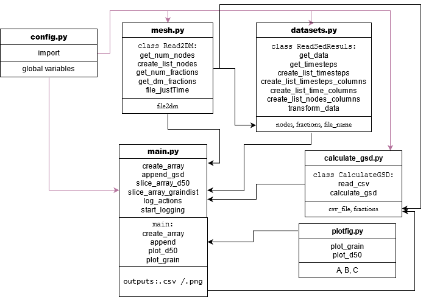

## Hydro_FT-2D Postprocessing Tool

### Motivation
The software [*Hydro_FT-2D*](https://www.hydrotec.de/software/hydro-as-2d/hydro_ft-2d-transportprozesse/) 
can be used for modelling sediment transport in rivers. 

The bed is therefore divided into three layers:
The active layer, under layer and bottom layer. For the evaluation of the sediment transport processes,
mainly the active layer and under layer are relevant. The transport is calculated fractionally (with up to
12 fractions) and result files are written for each fraction and each layer. When calculating with the
maximum number of fractions, this will lead to 24 different result files for the two relevant layers. 

When evaluating the results of a sediment transport model, not only the evolution of the bed level is of interest,
but also the development of the grain size distributions in the different layers. While the evolution of the bed 
level can easily be evaluated in the pre- and postprocessing software 
[*SMS*](https://www.aquaveo.com/software/sms-surface-water-modeling-system-introduction), the evaluation of grain
size distributions requires a heavy workload by the user: The result files are not readable with common editors 
and therefore have to be imported to SMS and exported as readable .dat-files. After that, they have to be put 
together (e.g. as columns in [*Microsoft Excel*](https://www.microsoft.com/de-de/microsoft-365/excel)) 
and the sum curve needs to be calculated.

The goal of this code is to make the evaluation of grain size distributions easier and faster. Therefore, 
two different databases are created by running the code:

1) A database containing morphodynamic results written by Hydro_FT-2D (percentiles of the fractions, mean grain
diameter, layer thickness) for every node and every time step

2) A second database which also includes the grain size distribution (sum curve) for every node at every time step

***In addition, the options to plot grain size distributions and the mean diameter are implemented.***

***

### Requirements

To run morphodynamic simulations and to pre- and postprocess, the softwares 
[*Hydro_FT-2D*](https://www.hydrotec.de/software/hydro-as-2d/hydro_ft-2d-transportprozesse/)
and [*SMS*](https://www.aquaveo.com/software/sms-surface-water-modeling-system-introduction) 
are required. This code works with the result files of *Hydro_FT-2D* Version 3.1.6. 
For postprocessing, *SMS* version 11 or higher is required.

The codes are created with Python 3.8 and can be run in the *hypy* environment, which can be downloaded 
[*here*](https://hydro-informatics.github.io/hypy_install.html#conda-env).

The codes use the following *Python* packages:
 - `glob`
 - `logging`
 - `numpy`
 - `pandas`
 - `time`
 - `matplotlib.pyplot`
***

### Usage
This is a step-by-step manual on how to use the code:

#### Running the Simulation and Postprocessing with SMS:
1. Run a morphodynamic simulation with *Hydro_FT-2D*.
2. After the simulation is finished, open the file *hydro_as-2d.2dm* in *SMS*.
The file contains the mesh and global simulation parameters.
3. From the subfolder */Data-out/FT/Layers/* load the file *AL.dat* in *SMS* by using 
drag and drop. This file contains the results for the fractions, mean diameter and layer thickness
of the active layer. 
4. In the *SMS* project explorer, select all the result files (*FA_AL-x, dm_AL, h_AL*) 
by holding *Shift* and marking them all. Then do a right click and select *Export Datasets*. As a file
type choose *Generic ASCII file*. Choose to select *All time steps*. Option: If you want to
generate the .csv-files for one specific time step only, choose *Current time step* and make sure
that the right time step is marked. Name the file *Datasets_AL.dat*
and export it to a folder of your choice.
5. Repeat steps 3 and 4 for the under layer by loading the file *UL.dat* and exporting all 
result files of all time steps to *Datasets_UL.dat*.

#### Download, Input and Running the Code
6. Download the *HFT_PP* repository and save the contents to a local folder.
7. Add the files *hydro_as-2d.2dm*, *Datasets_AL.dat* and *Datasets_UL.dat* to 
the same folder.
8. Run the *main.py* file. If you want to activate plotting of the
grain size distribution and the mean diameter call the respective functions. It is advisable to first plot 
the mean diameter over time and then identify a change in simulation time. With this information, the next
next step is to plot the distribution of the grains.
Be patient, this might take some time,
depending on the size of your mesh and the number of time steps you selected to export.

#### Output
9. Logging information will be written to the *logfile.log*.
10. The database containing the morphodynamic results written by *Hydro_FT-2D* 
(percentiles of the fractions, mean graindiameter, layer thickness) for every node and
 every time step will be exported to *Data_transformed_AL.csv* and *Data_transformed_UL.csv*.
11. The database which also includes the grain size distributions (sum curve) will be
exported to *Data_GSD_AL.csv* and *Data_GSD_UL.csv*.
12. The following figures will be shown and exported as png: 1) Mean diameter over time and the grain distribution and 2) Grain distribution.

### Code diagram
[]

### Files and classes
- **config.py**: This file contains the import of the required *Python* packages and
declares the *2dmfile* as a global variable. This can be done because the file always
has to be called *hydro_as-2d.2dm* in order for the simulation to run in *Hydro_FT-2D*.
- **mesh.py**: This file contains the *Read2DM* class, which reads parameters 
from the *hydro_as-2d.2dm* file. It contains methods to read the number of nodes and fractions
and to create a list of the mesh nodes and diameters of fractions. It also contains a method that returns the mesh file without the results. 
The output file gives you a quick view of the time step and the simulated time.
- **datasets.py**: This file contains the *ReadSedResults* class, which reads the *Datasets* 
files and contains methods needed to create the database of result files later exported as a 
.csv-file. These methods include getting the number of time steps and datasets as well as
creating lists of the time steps, time (in seconds) and node IDs which are later used as columns
in the database. The *transform_data* method then re-organizes all the results and creates a 
pandas dataframe representing the database. The class works for both the active and under layer. 
Therefore, only the *file name* of the layer is required as an argument.
- **calculate_gsd.py**: This file contains the *CalculateGSD* class, which contains methods to
read the previously built database and calculate the grain size distributions for every node and
time step.
- **plotfig.py**:This file contains the plotting functions. The *plot_grain* function uses the matplot
library and derives a semilogoratmic plot. In this case, the values of the axis Y corresponds of an array
resultant from a slice function. The *plot_d50*function uses the matplot library and derives a linear
plot. For this figure, the values are extracted from a 2D array resultant from a slice function.
- **main.py**: In this file, first the numbers of nodes and fractions are read by using the methods
implemented in the *Read2DM* class. Two functions are created: The *create_array* function uses the
methods of the *ReadSedResults* class in order to create a pandas dataframe representing the database
of the results written by *Hydro_FT-2D*. The dataframe is then exported as a .csv-file. The *append_gsd*
function uses the methods of the *CalculateGSD* class in order to append the grain size distributions
to the previously built dataframe and export it as a .csv-file. Furthermore, log actions are 
implemented. The *main* function then uses the previously mentioned functions to create the databases
for both the active and under layer and export them. Depending the requirement of the user, the figures can be called
using the plotting functions. 
A performance counter is implemented to indicate the time needed for running the code.

### Authors
The code was developped by 
[Maria Ponce Guzman](https://www.iws.uni-stuttgart.de/en/institute/team/Ponce-Guzman/)
& [Maximilian Kunz](https://www.iws.uni-stuttgart.de/institut/team/Kunz-00002/)
at the [Department of Hydraulic Engineering and Water Resources Management](https://www.iws.uni-stuttgart.de/en/lww/)
of the [University of Stuttgart](https://www.uni-stuttgart.de/en/).

